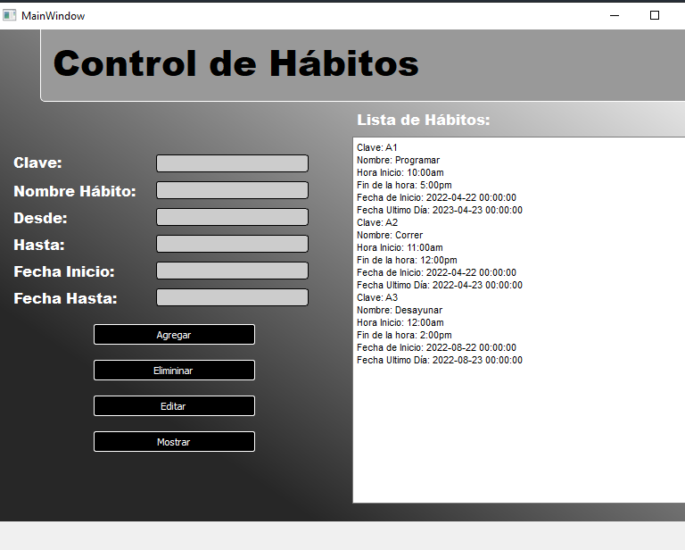

# Control de Hábitos

## Herramientas Usadas
* Python
* Sqlserver
* QtDisainer
* Pyside2

## Descripción y Problemática a Resolver
Este app de escritorio la realize para controlar mis hábitos, para así poder controlar mi día a día mejor, ser más productivo y alcanzar metas en ciertos tiempos establecidos, la app maneja el estilo CRUD con una base en sqlserver sencilla y rapida, los parametros yo los elegí de acuerdo a lo que yo considere mejor para mi, es algo simple pero ayuda mucho con algo muy importante que es el control de hábitos.

## Sobre el código
Los archivos habitos.ui y ui_habitos.py el primero es una generacion de la interfaz hecha en Qtdisainer, el segundo es el generado del primero pero en terminación python para manejo de los Widgets de la interfaz por medio de POO, el archivo core.py es para correr todo el programa solo desde ahí, los archivos main y habitos control manejan la logica del programa, main maneja codigo logico de widgets, y habitos control maneja la logica con la base de datos.

## Imagen de Muestra
